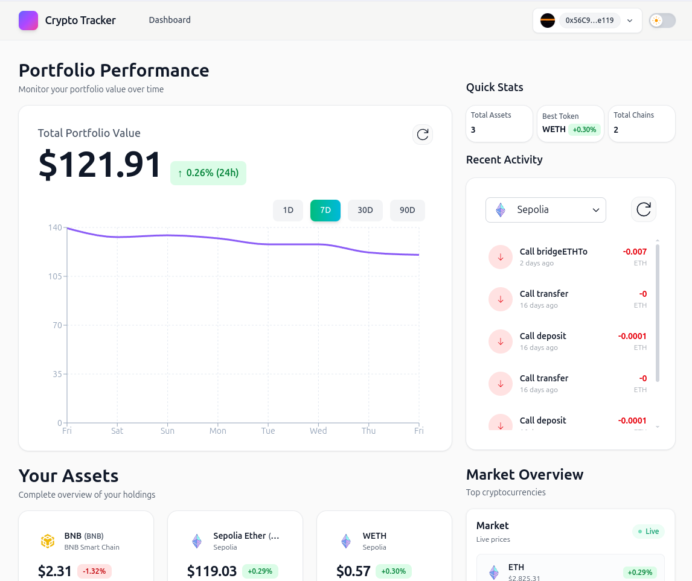

# Crypto Portfolio Tracker

A modern, multi-chain portfolio tracker inspired.  
Supports Ethereum, Polygon, Arbitrum, Base, Optimism and many more.

Demo: https://crypto-dashboard-tau-five.vercel.app/



## Features
- Instant wallet connection (MetaMask, WalletConnect, etc.)
- Real-time prices and 24h change via Coingecko
- Transaction history with network selector
- Fully responsive + dark mode
- Secure server-side API keys
- Built with Next.js 14 App Router

## Quick Start

### 1. Clone the repository
```bash
git clone https://github.com/cabad11/crypto_dashboard
cd crypto-tracker
```
### 2. Copy the example environment file and fill in your API keys in .env
```bash
cp .env.example .env
```
### 4. Install dependencies
```bash
npm install
```
### 5. Run the development server
```bash
npm run dev
```
### 6. Build and start production
```bash
npm run build
npm start
```
### Testing
```bash
npm run test          
npm run test:coverage

### Tech Stack
-Next.js 16
-Wagmi v2 + viem
-Tailwind CSS
-TanStack Query
-Coingecko API (prices)
-Etherscan APIs (transactions)

[](coverage/lcov-report/index.html)